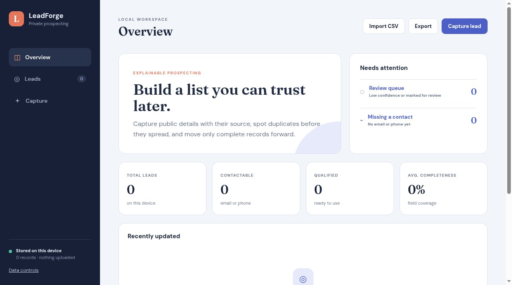

# LeadForge

A private, local-first workspace for turning public business details into an explainable lead list.



**Live:** https://aeiouvcode.github.io/leadforge/

## About

Capture leads by hand or import a CSV, keep notes on why each one fits, and export the list when you are done. LeadForge works offline after the first load, and the list never leaves the browser.

## Run locally

```sh
git clone https://github.com/aeiouvcode/leadforge.git
cd leadforge
python3 -m http.server 8000
```

Then open http://localhost:8000.

## Layout

```
index.html   app shell
app.js       application logic
styles.css   styles
docs/        README assets
```
